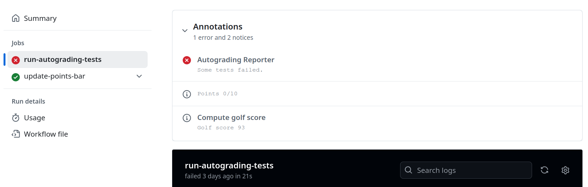

[](https://classroom.github.com/a/cSmwN9qS)
# Haskell: Golf


<details>
<summary>Guidelines</summary>

## Guidelines

When solving the homework, strive to create not just code that works, but code that is readable and concise.
Try to write small functions which perform just a single task, and then combine those smaller
pieces to create more complex functions.

Don’t repeat yourself: write one function for each logical task, and reuse functions as necessary.

Don't be afraid to introduce new functions where you see fit.

### Sources

Each task has corresponding source file in [src](src) directory where you should implement the solution.

### Building

All solutions should compile ~~without warnings~~ with following command:

```bash
stack build
```

### Testing

You can and should run automated tests before pushing solution to GitHub via

```bash
stack test --test-arguments "-p TaskX"
```

where `X` in `TaskX` should be number of corresponding Task to be tested.

So to run all test for the first task you should use following command:

```bash
stack test --test-arguments "-p Task1"
```

You can also run tests for all tasks with just

```bash
stack test
```

### Debugging

For debugging you should use GHCi via stack:

```bash
stack ghci
```

You can then load your solution for particular task using `:load TaskX` command.

Here is how to load Task1 in GHCi:

```bash
$ stack ghci
ghci> :load Task1
[1 of 1] Compiling Task1 ( .../src/Task1.hs, interpreted )
Ok, one module loaded.
```

> **Note:** if you updated solution, it can be quickly reloaded in the same GHCi session with `:reload` command
> ```bash
> ghci> :reload
> ```

</details>

## Preface

This assignment is inspired by [code golf](https://code.golf) game where your goal is not only
to correctly solve each task, but to do it in the least amount of symbols.

Regardless of your "golf score" all solutions that pass automated tests and review will get the full credit.

### Rules

- Comments, imports, pragmas and type signatures do not count towards your golf score
- Whitespaces do not count towards your golf score
  (so please keep your solutions readable with all appropriate spacing)
- Splitting your solution in separate files is **not allowed**
- You can use any modules that GHC ships with by default
  (not only [Prelude](https://hackage.haskell.org/package/base-4.21.0.0/docs/Prelude.html),
  but also for example [Data.List](https://hackage.haskell.org/package/base-4.21.0.0/docs/Data-List.html))

### Score

To calculate "golf score" of your solution you can run the following command
(first run will take some time to build necessary dependencies):

```bash
$ stack run
93
```

It will calculate the score (which is the length of your solution) according to rules above.

The same score is automatically calculated when you push your solution to GitHub
and will be displayed at the top of this README,
as well as in the "Annotations" section of automated test run in GitHub actions:



## Task 1 (10 points)

For this assignment your task is to implement the following functions

- `encode` that compresses given list using
  [run-length encoding](https://en.wikipedia.org/wiki/Run-length_encoding)
  algorithm
  ```haskell
  encode :: Eq a => [a] -> [(Int, a)]
  ```
  **Example:**
  ```haskell
  >>> encode "aaabbccaadaaa"
  [(3,'a'),(2,'b'),(2,'c'),(2,'a'),(1,'d'),(3,'a')]
  >>> encode "abc"
  [(1,'a'),(1,'b'),(1,'c')]
  >>> encode []
  []
  ```

- `decode` that decompresses given data encoded using
  [run-length encoding](https://en.wikipedia.org/wiki/Run-length_encoding)
  ```haskell
  decode :: [(Int, a)] -> [a]
  ```
  **Example:**
  ```haskell
  >>> decode [(3,'a'),(2,'b'),(2,'c'),(2,'a'),(1,'d'),(3,'a')]
  "aaabbccaadaaa"
  >>> decode [(1,'a'),(1,'b'),(1,'c')]
  "abc"
  >>> decode []
  []
  ```
  > **Note:** `Eq a` constraint is not necessary for decoding.

- `rotate` that rotates given *finite* list to the left for a given amount `N`
  ```haskell
  rotate :: Int -> [a] -> [a]
  ```
  **Example:**
  ```haskell
  >>> rotate 3 "abcdefgh"
  "defghabc"
  >>> rotate (-2) "abcdefgh"
  "ghabcdef"
  >>> rotate 0 "abcdefgh"
  "abcdefgh"
  >>> rotate 5 "abc"
  "cab"
  >>> rotate 5 ""
  ""
  ```
  > **Note:** if `N` is negative, then function rotates to the right instead.
